# SOP-DESIGN.md

## Desain Arsitektur SOP — [Nama Bisnis] Korean Fried Chicken

**Versi:** 1.0
**Tanggal:** 29 Agustus 2026
**Status:** Draft — untuk direview sebelum diimplementasikan
**Skala saat ini:** 2 cabang, target scale up

---

## 1. Tujuan Dokumen

Dokumen ini menjelaskan **desain arsitektur SOP** (bukan isi SOP itu sendiri) untuk operasional bisnis Korean Fried Chicken dengan produk utama: Ayam Wings, Ayam Pop, Topokki, dan Minuman.

Tiga tujuan utama yang mendasari desain ini:
1. **Kualitas terjaga** — konsisten di setiap cabang, tidak tergantung siapa yang kerja
2. **Food cost terkendali** — terukur dan bisa diaudit
3. **Tim menjadi teratur** — standar kerja jelas, mudah dilatih ke staff baru

---

## 2. Prinsip Desain

### 2.1 Dua Model Berpikir yang Digabung

Desain SOP ini menggabungkan dua pendekatan yang saling melengkapi:

**A. Flow-Based (mengikuti alur fisik barang)**
Terinspirasi dari logika gudang/warehouse — barang punya perjalanan fisik yang harus dikontrol titik per titik: *Supplier → Terima → Simpan → Ambil → Olah → Sajikan*. Pendekatan ini dipilih karena setiap titik selisih atau kebocoran food cost bisa langsung dilacak ke SOP mana yang bermasalah.

**Catatan penting:** F&B **berbeda dari gudang murni** pada satu titik krusial — begitu bahan baku masuk fase produksi, terjadi **transformasi** (SKU berubah, bobot berubah karena yield loss, sifat penyimpanan berubah dari "boleh lama di freezer" jadi "harus habis dalam hitungan jam"). Karena itu, alur barang sebenarnya adalah **dua sistem yang disambung**:
- **Sistem Gudang** (Purchasing → Storage → Picking) — dikontrol dengan metrik *kuantitas & selisih stok*
- **Sistem Produksi** (Olah → Sajikan) — dikontrol dengan metrik *yield %, waktu, dan suhu*

**B. Value Chain-Based (mengikuti fungsi bisnis)**
Untuk aktivitas di luar alur fisik barang (orang, transaksi, keuangan, aset), SOP dikelompokkan menjadi dua cluster besar: **Cluster Produk** dan **Cluster Non-Produk** — lihat Bagian 5 untuk dasar teorinya.

### 2.2 Prinsip Penyederhanaan

SOP digabung menjadi satu dokumen jika memenuhi salah satu dari tiga kriteria:
1. Dikerjakan oleh orang/role yang sama
2. Terjadi berurutan langsung tanpa jeda proses lain
3. Kalau dipisah, dokumennya cuma jadi 1-2 halaman (terlalu tipis untuk berdiri sendiri)

SOP **tidak digabung** (tetap berdiri sendiri) jika:
- Punya *Critical Control Point* (CCP) yang berbeda secara teknis (misal: WI per produk — suhu & waktu masak Wings berbeda dari Topokki)
- Sensitif dan butuh jejak audit sendiri (misal: Cash Handling)
- Butuh skill/kompetensi berbeda dari SOP di sekitarnya (misal: Komplain Pelanggan vs Layanan Pesanan)

---

## 3. Hierarki Dokumen (4 Level)

Struktur mengikuti **piramida dokumentasi ISO 9001** yang lazim dipakai dalam sistem manajemen mutu:

| Level | Nama (istilah ISO) | Isi dalam bisnis ini |
|---|---|---|
| **Level 0** | Quality Manual | Kebijakan Mutu Perusahaan — standar rasa brand, target food cost %, komitmen food safety |
| **Level 1** | Quality Procedures | 15 SOP fungsional (lihat Bagian 4) — menjawab "siapa melakukan apa dan kapan" |
| **Level 2** | Work Instructions (WI) | Instruksi kerja spesifik per produk (WI Wings, WI Pop, WI Topokki, WI Saus, WI Minuman) — menjawab "bagaimana cara mengerjakannya, langkah demi langkah" |
| **Level 3** | Forms, Records & Checklist | Bukti pelaksanaan: form suhu, form waste log, form stock opname, checklist training, dll. |

Prinsip level ini: **Level 0 tidak pernah menyebutkan detail teknis**, Level 1 tidak menyebutkan takaran/suhu spesifik (itu didelegasikan ke Level 2), dan Level 2/3 adalah dokumen yang paling sering direvisi karena paling dekat dengan operasional harian.

---

## 4. Struktur SOP Final (15 Dokumen)

### 4.1 Diagram Hierarki

```mermaid
flowchart TD
    ROOT["SOP FnB Fried Chicken"]

    ROOT --> BARANG["CLUSTER PRODUK"]
    ROOT --> NONBARANG["CLUSTER NON-PRODUK"]

    BARANG --> B1["SOP 1<br/>Purchasing dan Penerimaan Barang"]
    BARANG --> B2["SOP 2<br/>Penyimpanan dan Pengambilan Barang"]
    BARANG --> B3["SOP 3<br/>Produksi"]
    BARANG --> B4["SOP 4<br/>Stock Opname dan Kontrol Kualitas"]

    B3 --> WI1["WI Ayam Wings"]
    B3 --> WI2["WI Ayam Pop"]
    B3 --> WI3["WI Topokki"]
    B3 --> WI4["WI Saus Korea"]
    B3 --> WI5["WI Minuman"]

    NONBARANG --> OPS["Operasional"]
    NONBARANG --> HR["Tim"]
    NONBARANG --> FIN["Keuangan"]
    NONBARANG --> ASET["Aset dan Kebersihan"]
    NONBARANG --> LEGAL["Kepatuhan"]

    OPS --> N1["SOP 5<br/>Buka-Tutup Outlet"]
    OPS --> N2["SOP 6<br/>Layanan Pesanan"]
    OPS --> N3["SOP 7<br/>Cash Handling"]
    OPS --> N4["SOP 8<br/>Komplain Pelanggan"]

    HR --> N5["SOP 9<br/>Manajemen Staff Baru"]
    HR --> N6["SOP 10<br/>Manajemen Tim Harian"]

    FIN --> N7["SOP 11<br/>Reporting"]
    FIN --> N8["SOP 12<br/>Approval Pengeluaran"]

    ASET --> N9["SOP 13<br/>Perawatan dan Penanganan Alat"]
    ASET --> N10["SOP 14<br/>Kebersihan Outlet"]

    LEGAL --> N11["SOP 15<br/>Kepatuhan dan Keselamatan"]

    style ROOT fill:#fff3bf,stroke:#f59e0b,stroke-width:2px
    style BARANG fill:#a5d8ff,stroke:#4a9eed,stroke-width:2px
    style NONBARANG fill:#d0bfff,stroke:#8b5cf6,stroke-width:2px
    style B3 fill:#b2f2bb,stroke:#22c55e,stroke-width:2px
    style B4 fill:#eebefa,stroke:#ec4899,stroke-width:2px
    style OPS fill:#ffd8a8,stroke:#f59e0b
    style HR fill:#ffd8a8,stroke:#f59e0b
    style FIN fill:#ffd8a8,stroke:#f59e0b
    style ASET fill:#ffd8a8,stroke:#f59e0b
    style LEGAL fill:#ffd8a8,stroke:#f59e0b
```

### 4.2 Rincian Cluster Produk (4 SOP + 5 WI)

| # | SOP | Cakupan | Digabung dari |
|---|---|---|---|
| SOP 1 | Purchasing & Penerimaan Barang | Order ke supplier, approval, cek kualitas/suhu/expiry saat barang datang, cocokkan dengan invoice | Procurement + Receiving (1 orang, berurutan langsung) |
| SOP 2 | Penyimpanan & Pengambilan Barang | Penempatan barang sesuai kategori (dry/chiller/freezer), FIFO/FEFO, cara ambil stok untuk produksi | Storage + Picking/Issuing (role yang sama, sifat sama) |
| SOP 3 | Produksi | Payung untuk 5 Work Instruction di bawahnya, termasuk standar penyajian/plating di tiap WI | — (tidak digabung, lihat 4.3) |
| SOP 4 | Stock Opname & Kontrol Kualitas | Cross-check barang masuk vs keluar vs terjual, investigasi selisih | Berdiri sendiri (fungsi kontrol/audit, beda sifat dari operasional harian) |

### 4.3 Rincian Work Instruction (Level 2 — Anak dari SOP 3)

**Tidak digabung menjadi satu "SOP Penyajian"** karena empat alasan:

1. **Critical Control Point berbeda per produk** — Wings butuh waktu marinasi & suhu fry untuk potongan besar; Pop butuh suhu berbeda karena potongan kecil (risiko overcooked kalau pakai standar Wings); Topokki tidak digoreng sama sekali (proses rebus, CCP-nya suhu rebus & waktu, bukan suhu minyak)
2. **Recipe costing harus presisi per item** — 1 WI = 1 recipe costing card; kalau digabung, cost per porsi tidak bisa dihitung akurat per produk
3. **Revisi jadi granular** — ubah resep Topokki tidak memaksa revisi ulang dokumen Wings dan Pop
4. **Training jadi modular** — staff bisa disertifikasi kompetensi per produk ("lulus WI Wings, belum lulus WI Topokki"), bukan all-or-nothing

| WI | Fokus Standar |
|---|---|
| WI Ayam Wings | Berat per potong (yield), waktu marinasi, suhu & waktu deep fry, takaran coating saus |
| WI Ayam Pop | Ukuran potong konsisten, breading ratio, waktu fry (beda dari Wings) |
| WI Topokki | Takaran tteok per porsi, base sauce recipe, waktu rebus, kekentalan saus |
| WI Saus Korea | Resep batch "mother sauce" (gochujang/soy garlic/sweet spicy) — dipakai lintas menu |
| WI Minuman | Takaran syrup, es, garnish, standar penyajian |

Setiap WI **diakhiri dengan section "Standar Penyajian & Plating"** — bukan SOP terpisah, tapi bagian integral dari WI itu sendiri, agar konteks penyajian tetap nyambung dengan proses masaknya (termasuk *holding time* — batas waktu maksimal dari selesai masak sampai harus disajikan).

### 4.4 Rincian Cluster Non-Produk (11 SOP)

| # | SOP | Cakupan | Digabung dari |
|---|---|---|---|
| SOP 5 | Buka-Tutup Outlet | Checklist opening & closing harian | Opening + Closing |
| SOP 6 | Layanan Pesanan | Order taking (dine-in, take away, delivery platform) + standar packaging | Order Taking + Packaging |
| SOP 7 | Cash Handling | Buka-tutup kasir, penanganan selisih kas, rekonsiliasi | Berdiri sendiri (sensitif, butuh jejak audit sendiri) |
| SOP 8 | Komplain Pelanggan | Respon komplain, batas kompensasi | Berdiri sendiri (skill beda dari layanan normal) |
| SOP 9 | Manajemen Staff Baru | Rekrutmen → onboarding → training & sign-off kompetensi | Rekrutmen + Onboarding + Training |
| SOP 10 | Manajemen Tim Harian | Jadwal shift, penilaian kinerja | Jadwal Shift + Penilaian Kinerja |
| SOP 11 | Reporting | Laporan harian per cabang + konsolidasi multi-cabang | Laporan Harian + Konsolidasi |
| SOP 12 | Approval Pengeluaran | Approval pengeluaran operasional di luar bahan baku | Berdiri sendiri (kontrol keuangan, beda fungsi dari reporting) |
| SOP 13 | Perawatan & Penanganan Alat | Maintenance preventif + penanganan kerusakan mendadak | Maintenance + Kerusakan Mendadak |
| SOP 14 | Kebersihan Outlet | Cleaning area umum + pest control | Cleaning + Pest Control |
| SOP 15 | Kepatuhan & Keselamatan | Perizinan (izin usaha, halal, izin edar) + K3 | Perizinan + K3 |

---

## 5. Dasar Referensi dan Justifikasi

### 5.1 Untuk Struktur Hierarki 4-Level

**ISO 9001 — Piramida Dokumentasi Sistem Manajemen Mutu**

| Level ISO | Detail |
|---|---|
| Level 1: Quality Manual | Manual utama mencakup seluruh requirement ISO — visi, kebijakan, tujuan, dengan referensi ke prosedur di bawahnya |
| Level 2: Quality Procedures | Prosedur menjawab "siapa melakukan apa dan kapan" — 6 prosedur wajib menurut standar, plus tambahan sesuai kebutuhan bisnis |
| Level 3: Work Instructions | Instruksi langkah demi langkah, terhubung ke prosedur di atasnya, spesifik untuk satu jenis pekerjaan |
| Level 4: Forms & Records | Output dari prosedur dan work instruction yang sudah dijalankan |

Struktur Root → SOP → WI → Record pada dokumen ini **mengikuti pola yang sama persis**.

### 5.2 Untuk Pembagian Cluster Produk vs Non-Produk

**Michael Porter — Value Chain Model (1985, *Competitive Advantage*)**

Model ini membagi seluruh aktivitas organisasi menjadi dua kategori:
- **Primary Activities** — aktivitas yang terlibat langsung dalam membawa produk/jasa dari konsep sampai ke pelanggan (inbound logistics, operasi, outbound logistics, marketing & sales, service)
- **Support Activities** — aktivitas pendukung yang menyediakan input/infrastruktur untuk membantu aktivitas primer (procurement, HR management, pengembangan teknologi, infrastruktur)

Pemetaan ke struktur dokumen ini:

| Porter's Value Chain | Cluster / SOP |
|---|---|
| Inbound Logistics | SOP 1–2 (Purchasing, Storage) |
| Operations | SOP 3 (Produksi + WI) |
| Outbound Logistics / Service | SOP 6 (Layanan Pesanan) |
| Support: HR | SOP 9–10 (Manajemen Staff) |
| Support: Procurement/Infrastructure | SOP 12–13 (Approval, Perawatan Alat) |
| Support: Firm Infrastructure | SOP 11, 15 (Reporting, Kepatuhan) |

### 5.3 Untuk Metodologi HACCP di dalam SOP Teknis

HACCP **bukan SOP tersendiri** — ia adalah metodologi analisis yang hasilnya "disuntikkan" sebagai klausul di dalam SOP/WI yang relevan (SOP 1, SOP 2, dan seluruh WI Produksi di SOP 3). SOP administratif (Cash Handling, Reporting, dll.) tidak memerlukan analisis HACCP karena tidak menyentuh titik kritis keamanan pangan.

**Codex Alimentarius CAC/RCP 1-1969, Rev. 4-2003** (Annex: HACCP System and Guidelines for its Application)
Dokumen sumber asli 7 prinsip HACCP (hazard analysis, penentuan CCP, critical limit, monitoring, corrective action, verifikasi, dokumentasi). Codex juga menegaskan bahwa sebelum HACCP diterapkan, sektor terkait harus sudah punya *prerequisite program* seperti praktik higienis yang baik — dasar kenapa SOP kebersihan/sanitasi mendahului penerapan HACCP detail.

**ISO 22000:2018 — Food Safety Management Systems**
Standar internasional yang mengintegrasikan prinsip HACCP dan Codex ke dalam sebuah *auditable requirement*, menggabungkan rencana HACCP dengan program prasyarat. Berlaku untuk seluruh organisasi di rantai pangan tanpa memandang ukuran — relevan sebagai target jangka panjang jika bisnis ini scale up dan butuh sertifikasi formal. ISO 22000 mengikuti *High-Level Structure* yang sama dengan ISO 9001, sehingga kedua standar bisa diintegrasikan dalam satu sistem dokumentasi.

**SNI 01-4852-1998** — Sistem Analisis Bahaya dan Pengendalian Titik Kritis (HACCP) serta Pedoman Penerapannya
Adopsi resmi Codex HACCP ke Standar Nasional Indonesia oleh Badan Standarisasi Nasional — rujukan legal/lokal jika suatu saat diperlukan audit atau sertifikasi resmi di Indonesia.

**BPOM — Cara Produksi Pangan Olahan yang Baik (CPPOB)**
Regulasi nasional yang mengatur *prerequisite program* (Good Manufacturing Practice) sebelum HACCP diterapkan secara detail.

**EU Guidance on FSMS Implementation (2022, EU Commission)**
Memberikan dukungan terhadap pendekatan ISO 22000 dalam pengembangan *Operational Prerequisite Programmes* (OPRP) — langkah kontrol untuk mencegah/mengurangi bahaya keamanan pangan signifikan ke level yang bisa diterima. Berguna sebagai panduan implementasi praktis, bukan hanya teks standar mentah.

---

## 6. Adaptasi untuk Skala Outlet Kecil (Solo/Dua Orang Shift)

Struktur 15 SOP di atas tetap berlaku sebagai **master dokumen referensi**, tetapi cara eksekusinya disesuaikan ketika 1 outlet dijalankan oleh 1–2 orang dengan role fleksibel (merangkap kasir dan masak):

### 6.1 Yang Berubah

- **Pengelompokan role-based → task-based**: SOP dibaca sebagai checklist linear mengikuti urutan waktu dalam satu shift (*Buka → Cek Storage → Prep Bahan → [siklus: Terima Order → Masak → Kasir] → Closing → Stock Opname ringkas*), bukan dipisah per departemen.
- **Beberapa SOP administratif "dilipat"** menjadi checklist tunggal yang mudah dicentang manual (misal: SOP 5 + cek storage jadi 1 checklist pagi; SOP 7 + SOP 5 bagian tutup jadi 1 checklist malam).
- **Format dokumen jadi lebih ringkas & visual** — 1 halaman checklist atau kartu resep yang ditempel di area kerja, bukan dokumen panjang, karena staff tidak sempat baca dokumen formal di tengah jam sibuk.

### 6.2 Yang TIDAK Boleh Disederhanakan

| Elemen | Alasan |
|---|---|
| WI per produk | Standar rasa harus konsisten terlepas dari siapa yang masak hari itu |
| Titik kritis HACCP (suhu & waktu) | Soal keamanan pangan, bukan soal jumlah staff yang jaga |
| Cash Handling | Justru makin penting saat 1 orang pegang kasir — perlu jejak jelas |
| Recipe costing | Tetap dibutuhkan untuk menghitung food cost, terlepas dari skala staff |

---

## 7. Ringkasan Justifikasi Desain

| Keputusan Desain | Alasan | Sumber/Rujukan |
|---|---|---|
| Hierarki 4 level (Manual → SOP → WI → Record) | Standar dokumentasi mutu yang teruji dan bisa diaudit | ISO 9001 Documentation Structure |
| Dua cluster besar (Produk vs Non-Produk) | Memisahkan aktivitas inti pembentuk produk dari aktivitas pendukung | Porter's Value Chain Model |
| Alur SOP mengikuti pergerakan fisik barang | Memudahkan pelacakan sumber masalah/selisih cost | Prinsip warehouse management (adaptasi) |
| WI dipisah per produk, tidak digabung jadi "SOP Penyajian" | CCP, costing, dan kompetensi training berbeda per item | Prinsip HACCP (Codex/ISO 22000) + recipe costing |
| HACCP disuntikkan ke SOP teknis, bukan jadi SOP terpisah | HACCP adalah metodologi analisis, bukan dokumen operasional berdiri sendiri | Codex CAC/RCP 1-1969, ISO 22000 |
| Penggabungan SOP berdasarkan 3 kriteria (Bagian 2.2) | Mengurangi jumlah dokumen tanpa mengorbankan kejelasan tanggung jawab | Praktik umum manajemen dokumentasi |

---

## 8. Status & Langkah Selanjutnya

- [ ] Review isi tiap SOP secara detail (belum ditulis lengkap, baru kerangka/judul)
- [ ] Tulis Level 0 (Kebijakan Mutu) sebagai dokumen pembuka
- [ ] Tulis WI per produk lengkap dengan resep, takaran, dan critical limit
- [ ] Integrasikan hasil analisis HACCP ke SOP 1, SOP 2, dan seluruh WI di SOP 3
- [ ] Buat versi ringkas (checklist 1 halaman) untuk implementasi di outlet skala kecil
- [ ] Sambungkan SOP 4 (Stock Opname) dengan sistem aplikasi stok multi-cabang yang sedang dikembangkan
